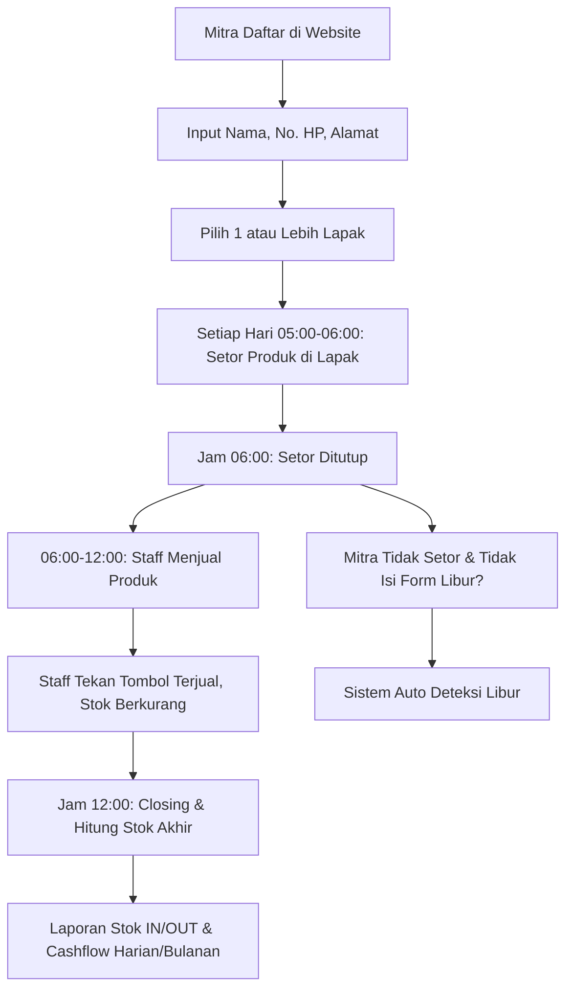

# Implementasi Sistem BGM Winner

Dokumen ini berisi garis besar perancangan sistem BGM Winner: sistem manajemen penitipan dan penjualan produk Mitra di lapak BGM. Dokumen ini akan terus diperbarui seiring berjalannya pengembangan.

---

## 1. Ringkasan Sistem

BGM Winner adalah sistem berbasis website untuk mengelola produk titipan (konsinyasi) dari para Mitra. Produk Mitra dititipkan di satu atau lebih Lapak BGM setiap pagi, lalu dijual oleh Staff di lapak tersebut dari jam 06:00 sampai 12:00. Sistem mencatat stok IN (setoran), penjualan (stok OUT), menangani izin libur Mitra, serta menghasilkan laporan stok dan cashflow harian/bulanan.

### Nilai Ekonomi Per Produk Terjual

| Komponen | Nilai |
|---|---|
| Harga jual ke pembeli | Rp 10.000 |
| Bagian Mitra | Rp 9.000 |
| Jasa penjualan BGM Winner | Rp 1.000 |

> Asumsi: harga jual = bagian Mitra (Rp 9.000) + jasa BGM (Rp 1.000) = Rp 10.000. Lihat bagian "Pertanyaan Terbuka" untuk konfirmasi.

---

## 2. Entitas dan Peran Pengguna

### 2.1 Administrator
- Mengelola seluruh sistem: data pengguna, data lapak, data Mitra, pengaturan sistem.
- Mengelola laporan stok IN/OUT dan cashflow.
- Tidak terlibat langsung dalam transaksi harian di lapak.

### 2.2 Staff
- Bertugas di satu atau lebih lapak.
- Mengelola stok IN/OUT produk di lapak: menerima setoran Mitra, menekan tombol "Terjual" saat produk laku, dan melakukan closing/hitung stok pada jam 12:00.
- Melihat dan memasukkan setoran atas nama Mitra bila diperlukan.

### 2.3 Mitra
- Pemilik produk yang menitipkan jualannya ke BGM Winner.
- Mendaftar melalui website (Nama, No. Telp/HP, Alamat) dan memilih satu atau lebih Lapak.
- Setiap hari (05:00–06:00) menyetorkan produk ke lapak yang didaftar.
- Dapat melihat halaman Stok Produk untuk memantau produk yang masih tersisa.
- Dapat mengisi form libur, dan dapat melihat daftar Mitra yang libur.

### 2.4 Matriks Hak Akses

| Fitur | Admin | Staff | Mitra |
|---|---|---|---|
| Kelola pengguna (admin/staff/mitra) | Ya | Tidak | Tidak |
| Kelola data lapak | Ya | Tidak | Tidak |
| Registrasi Mitra baru | Ya | Tidak | Ya (daftar sendiri) |
| Input setoran harian | Ya | Ya | Ya |
| Tombol "Terjual" | Ya | Ya | Tidak |
| Closing lapak (jam 12:00) | Ya | Ya | Tidak |
| Halaman Stok Produk | Ya (semua) | Ya (lapaknya) | Ya (produknya) |
| Form libur | Ya (kelola) | Tidak | Ya (isi) |
| Daftar Mitra libur | Ya | Ya | Ya |
| Laporan stok & cashflow | Ya | Ya (lapaknya) | Ya (produknya) |

---

## 3. Alur Bisnis



### 3.1 Pendaftaran Mitra
1. Mitra membuka website BGM Winner dan memilih menu Daftar.
2. Mengisi Nama, No. Telp/HP, dan Alamat.
3. Memilih Lapak (boleh lebih dari satu, bahkan semua lapak).
4. Data tersimpan dan menunggu aktivasi/verifikasi oleh Admin (status aktif/nonaktif).

### 3.2 Setoran Harian (Stok IN)
1. Setiap hari pukul 05:00–06:00, Mitra datang ke lapak yang terdaftar.
2. Mitra mengisi form setoran: pilih produk dan jumlah setiap produk.
3. Staff lapak juga dapat memasukkan setoran atas nama Mitra jika diminta.
4. Pukul 06:00, setoran ditutup otomatis. Produk yang sudah diinput menjadi stok awal (stok IN) hari itu.
5. Jika Mitra terdaftar di beberapa lapak, setoran dilakukan per lapak.

### 3.3 Penjualan (Stok OUT)
1. Pukul 06:00–12:00, Staff menjual produk di lapak.
2. Setiap produk terjual, Staff menekan tombol "Terjual" pada produk tersebut.
3. Stok produk berkurang otomatis satu per satu hingga habis.
4. Produk dengan stok 0 tidak lagi ditampilkan sebagai stok tersedia.

### 3.4 Closing Lapak (Jam 12:00)
1. Pukul 12:00, Staff melakukan closing.
2. Staff menghitung sisa stok setiap produk secara fisik dan membandingkannya dengan stok di sistem.
3. Bila ada selisih (misal produk rusak/hilang), Staff melakukan penyesuaian dan mencatat alasan.
4. Setoran ditandai selesai (closed) dan data stok akhir dikunci.

### 3.5 Libur Mitra
1. Mitra yang ingin libur mengisi form libur (pilih tanggal dan alasan).
2. Jika Mitra tidak mengisi form libur tetapi tidak menyetorkan produk pada hari tersebut, sistem otomatis menetapkan status libur (auto-deteksi).
3. Mitra yang libur ditampilkan di halaman "Mitra Libur" dan dapat dilihat oleh Mitra lain.

### 3.6 Laporan
1. Laporan stok IN/OUT harian dan bulanan.
2. Laporan cashflow harian dan bulanan.
3. Rincian ada di bagian "Laporan".

---

## 4. Arsitektur dan Teknologi (Usulan)

> Stack ini masih usulan dan dapat dikonfirmasi sebelum pengembangan dimulai.

| Lapisan | Teknologi Usulan | Alternatif |
|---|---|---|
| Frontend | Vue 3 + Vite + Pinia | React/Next.js |
| Backend | Node.js + Express + TypeScript | Laravel (PHP), Django |
| ORM / DB | Prisma + MySQL 8 | PostgreSQL |
| Autentikasi | JWT + bcrypt | Laravel Sanctum/Session |
| Penjadwalan (auto libur) | node-cron | Cron sistem / Laravel Scheduler |
| Export laporan | CSV / Excel (exceljs) | — |

### 4.1 Struktur Proyek (usulan)

```
backend/            # API Node.js/Express
  prisma/           # Schema database + migration
  src/
    routes/         # Auth, users, lapaks, deposits, sales, leaves, reports
    controllers/
    services/       # Logika bisnis (deposit window, auto leave, pricing)
    middleware/     # Auth & role guard
    jobs/           # Cron: auto deteksi libur
frontend/           # Vue 3 + Vite
  src/
    views/          # Halaman per role
    stores/         # Pinia
    api/            # Klien API
```

---

## 5. Rancangan Database

### 5.1 Diagram Relasi (ringkas)

```
users 1---n mitra_lapak n---1 lapaks
users 1---n products
users 1---n daily_deposits n---1 lapaks
daily_deposits 1---n deposit_items n---1 products
users 1---n leaves n---1 lapaks
users 1---n payments
```

### 5.2 Tabel `users`
Data semua pengguna (Admin, Staff, Mitra).

| Kolom | Tipe | Keterangan |
|---|---|---|
| id | int PK | |
| name | varchar | Nama lengkap |
| phone | varchar | No. Telp/HP (unique) |
| address | text | Alamat (wajib untuk Mitra) |
| role | enum | `admin` / `staff` / `mitra` |
| password | varchar | Hash |
| status | enum | `active` / `inactive` |
| created_at / updated_at | datetime | |

### 5.3 Tabel `lapaks`
Data Lapak BGM.

| Kolom | Tipe | Keterangan |
|---|---|---|
| id | int PK | |
| name | varchar | Nama lapak |
| location | varchar | Lokasi/alamat lapak |
| status | enum | `active` / `inactive` |
| created_at / updated_at | datetime | |

### 5.4 Tabel `mitra_lapak`
Registrasi Mitra ke lapak (banyak ke banyak).

| Kolom | Tipe | Keterangan |
|---|---|---|
| id | int PK | |
| mitra_id | FK users.id | |
| lapak_id | FK lapaks.id | |
| status | enum | `active` / `inactive` |
| created_at | datetime | |
| unique(mitra_id, lapak_id) | | |

### 5.5 Tabel `products`
Katalog produk milik Mitra.

| Kolom | Tipe | Keterangan |
|---|---|---|
| id | int PK | |
| mitra_id | FK users.id | Pemilik produk |
| name | varchar | Nama produk |
| unit | varchar | Satuan (pcs, bungkus, dll) |
| price | decimal | Harga Mitra (default 9000) |
| status | enum | `active` / `inactive` |
| created_at / updated_at | datetime | |

### 5.6 Tabel `daily_deposits`
Setoran harian per Mitra per Lapak (stok IN).

| Kolom | Tipe | Keterangan |
|---|---|---|
| id | int PK | |
| date | date | Tanggal setoran |
| mitra_id | FK users.id | |
| lapak_id | FK lapaks.id | |
| status | enum | `open` / `closed` |
| submitted_at | datetime | Waktu input pertama |
| closed_at | datetime | Waktu closing jam 12 |
| unique(date, mitra_id, lapak_id) | | Satu setoran per hari |

### 5.7 Tabel `deposit_items`
Detail produk dalam setoran (mengelola stok per produk).

| Kolom | Tipe | Keterangan |
|---|---|---|
| id | int PK | |
| deposit_id | FK daily_deposits.id | |
| product_id | FK products.id | |
| initial_qty | int | Jumlah stok awal (IN) |
| sold_qty | int | Jumlah terjual (OUT) |
| remaining_qty | int | Sisa stok (dihitung) |
| price | decimal | Harga Mitra saat setoran |
| note | text | Catatan penyesuaian closing |

### 5.8 Tabel `leaves`
Libur Mitra (manual dan otomatis).

| Kolom | Tipe | Keterangan |
|---|---|---|
| id | int PK | |
| mitra_id | FK users.id | |
| lapak_id | FK lapaks.id | |
| leave_date | date | Tanggal libur |
| reason | varchar | Alasan (wajib utk manual) |
| source | enum | `manual` / `auto` |
| created_at | datetime | |
| unique(mitra_id, lapak_id, leave_date) | | |

### 5.9 Tabel `payments`
Pembayaran hasil penjualan kepada Mitra (stok OUT nilai rupiah).

| Kolom | Tipe | Keterangan |
|---|---|---|
| id | int PK | |
| mitra_id | FK users.id | |
| date_from / date_to | date | Periode penjualan |
| total_qty | int | Total produk terjual |
| total_amount | decimal | total_qty x 9000 |
| status | enum | `unpaid` / `paid` |
| paid_at | datetime | |
| paid_by | FK users.id | Admin yang membayar |

### 5.10 Tabel `settings`
Pengaturan sistem yang dapat diubah Admin.

| Key | Default | Keterangan |
|---|---|---|
| mitra_share | 9000 | Bagian Mitra per produk |
| bgm_fee | 1000 | Jasa BGM per produk |
| selling_price | 10000 | Harga jual ke pembeli |
| deposit_open | 05:00 | Jam mulai setoran |
| deposit_close | 06:00 | Jam tutup setoran |
| stall_close | 12:00 | Jam closing lapak |
| auto_leave_hour | 06:30 | Jam cron deteksi libur |

---

## 6. Logika Bisnis Utama

### 6.1 Jam Setoran
- Antara `deposit_open` (05:00) dan `deposit_close` (06:00): Mitra/Staff dapat membuat dan mengubah setoran.
- Setelah `deposit_close`: setoran terkunci, hanya bisa dibuka kembali oleh Admin/Staff via izin khusus.

### 6.2 Tombol "Terjual"
- Hanya Staff lapak yang menangani lapak tersebut (dan Admin) yang dapat menekan tombol.
- Setiap klik mengurangi `remaining_qty` sebesar 1 dan menambah `sold_qty` sebesar 1.
- Jika `remaining_qty` mencapai 0, produk otomatis berstatus "Habis" dan tidak tampil di halaman Stok Produk.
- Setiap klik dicatat untuk keperluan audit (siapa menjual, kapan).

### 6.3 Auto Deteksi Libur
- Cron berjalan setiap hari pada `auto_leave_hour` (06:30).
- Untuk setiap pasangan (Mitra aktif, Lapak terdaftar) pada tanggal tersebut:
  - Jika tidak ada `daily_deposits` dan tidak ada `leaves` manual → buat record `leaves` dengan `source = auto`.
- Mitra yang libur muncul di halaman "Mitra Libur".

### 6.4 Closing
- Pukul 12:00, Staff menekan tombol closing pada setoran.
- Sistem menampilkan daftar `initial_qty`, `sold_qty`, `remaining_qty`.
- Staff dapat menyesuaikan stok akhir bila ada selisih fisik, wajib mengisi alasan.

### 6.5 Pencatatan Cashflow
- **Cash IN**: penjualan = `sold_qty × selling_price` (Rp 10.000).
- **Cash OUT**: pembayaran ke Mitra = `sold_qty × mitra_share` (Rp 9.000).
- **Pendapatan BGM**: selisih = `sold_qty × bgm_fee` (Rp 1.000).
- Cashflow harian/bulanan dihitung dari agregasi data `deposit_items` (per tanggal/lapak) dan `payments`.

---

## 7. Fitur dan Halaman

### 7.1 Umum
- Login (Admin / Staff / Mitra), Logout.
- Dashboard ringkasan sesuai peran.

### 7.2 Administrator
- Kelola pengguna (CRUD, aktivasi Mitra, reset password).
- Kelola lapak (CRUD).
- Kelola Mitra & lapak terdaftar.
- Kelola payment ke Mitra.
- Pengaturan sistem (settings).
- Laporan stok IN/OUT dan cashflow (harian/bulanan), export CSV/Excel.

### 7.3 Staff
- Pilih lapak aktif.
- Lihat setoran hari ini di lapak.
- Input/ubah setoran atas nama Mitra (selama jam setoran).
- Halaman penjualan: daftar produk + tombol "Terjual".
- Closing lapak jam 12:00.
- Laporan stok & cashflow lapaknya (harian/bulanan).

### 7.4 Mitra
- Registrasi + pilih lapak.
- Form setoran harian (pilih produk & jumlah).
- Halaman **Stok Produk**: hanya produk dengan stok > 0 yang ditampilkan.
- Riwayat penjualan produk sendiri.
- Form libur (tanggal + alasan).
- Halaman **Mitra Libur** (lihat siapa yang libur).
- Laporan penjualan & estimasi pendapatan sendiri.

---

## 8. Laporan

### 8.1 Laporan Stok IN/OUT
- Filter: tanggal (harian) / rentang tanggal (bulanan), lapak, mitra.
- Kolom per produk: Stok Awal (IN), Terjual (OUT), Sisa, Total Nilai.
- Tersedia untuk Admin (semua) dan Staff (lapaknya) serta Mitra (produknya).

### 8.2 Laporan Cashflow
- Filter: tanggal / rentang tanggal, lapak, mitra.
- Kolom: Penjualan (IN), Pembayaran ke Mitra (OUT), Pendapatan Jasa BGM, Saldo.
- Versi harian dan versi bulanan (rekapitulasi).

---

## 9. Pertanyaan Terbuka (Perlu Konfirmasi)

1. **Interpretasi harga**: Apakah harga jual ke pembeli Rp 10.000 (Mitra Rp 9.000 + BGM Rp 1.000), atau harga jual tetap Rp 9.000 dan Rp 1.000 dipotong dari bagian Mitra (Mitra terima Rp 8.000)? → Default sistem saat ini: Rp 10.000.
2. **Waktu pembayaran Mitra**: Kapan BGM membayar hasil penjualan ke Mitra (harian, mingguan, bulanan, atau saat ditarik Mitra)?
3. **Apakah semua produk Mitra dihargai sama (Rp 9.000)**, atau bisa berbeda per produk?
4. **Setoran via perangkat siapa**: Mitra mengisi form setoran sendiri (dari HP) atau Staff yang mengisi? → Saat ini: keduanya bisa.
5. **Libur**: Apakah form libur diisi di hari yang sama (H-0) atau bisa dijadwalkan sebelumnya (H-1 dst)?
6. **Penyesuaian selisih stok saat closing**: Apakah selisih (hilang/rusak) ditanggung Mitra atau BGM?
7. **Notifikasi**: Apakah perlu notifikasi (WhatsApp/SMS/email) untuk pengingat setoran, produk habis, dsb?
8. **Fitur pembayaran digital**: Apakah perlu integrasi pembayaran (QRIS/e-wallet) untuk transaksi ke pembeli, atau cukup pencatatan manual?

---

## 10. Rencana Pengembangan (Milestone)

| Fase | Cakupan | Output |
|---|---|---|
| Fase 1 | Setup proyek, autentikasi, master data (users, lapaks, products, mitra_lapak) | Login & CRUD berjalan |
| Fase 2 | Setoran harian + tombol "Terjual" + closing | Siklus stok IN/OUT harian berjalan |
| Fase 3 | Halaman Stok Produk + form libur + halaman Mitra Libur + auto deteksi libur | Fitur libur & pemantauan stok |
| Fase 4 | Laporan stok IN/OUT & cashflow harian/bulanan + payment Mitra | Laporan lengkap |
| Fase 5 | Export laporan, notifikasi, penyempurnaan UI/UX, optimasi | Rilis penuh |

---

## 11. Catatan

- Semua field harga menggunakan tipe decimal agar aman untuk perhitungan uang.
- Transaksi stok dan penjualan memakai tanggal server; pastikan zona waktu server konsisten dengan zona waktu lapak.
- Konfirmasi jawaban pada bagian "Pertanyaan Terbuka" akan digunakan untuk memperbarui dokumen ini sebelum tahap implementasi dimulai.
